#  Virtuemart Docker para desarrollo

### PHP 7.2 + Mysql 5.5 + Virtuemart 3.2

### Requerimientos

**MacOS:**

Instalar [Docker](https://docs.docker.com/docker-for-mac/install/), [Docker-compose](https://docs.docker.com/compose/install/#install-compose) y [Docker-sync](https://github.com/EugenMayer/docker-sync/wiki/docker-sync-on-OSX).

**Windows:**

Instalar [Docker](https://docs.docker.com/docker-for-windows/install/), [Docker-compose](https://docs.docker.com/compose/install/#install-compose) y [Docker-sync](https://github.com/EugenMayer/docker-sync/wiki/docker-sync-on-Windows).

**Linux:**

Instalar [Docker](https://docs.docker.com/engine/installation/linux/docker-ce/ubuntu/) y [Docker-compose](https://docs.docker.com/compose/install/#install-compose).

### Como usar

Para instalar Virtuemart, hacer lo siguiente:

```
./start
./shell
```

### Paneles

**Web server:** http://localhost/

**Admin:** http://localhost/administrator

    user: admin
    password: password

### Importante
La primera vez es necesario instalar virtuemart y datos de prueba desde el sitio administrador, ir a http://localhost/administrator e instalar Virtuemart con datos de prueba.

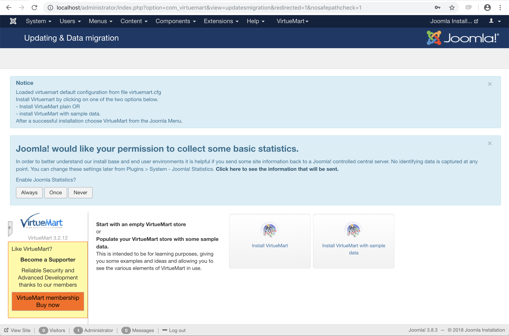

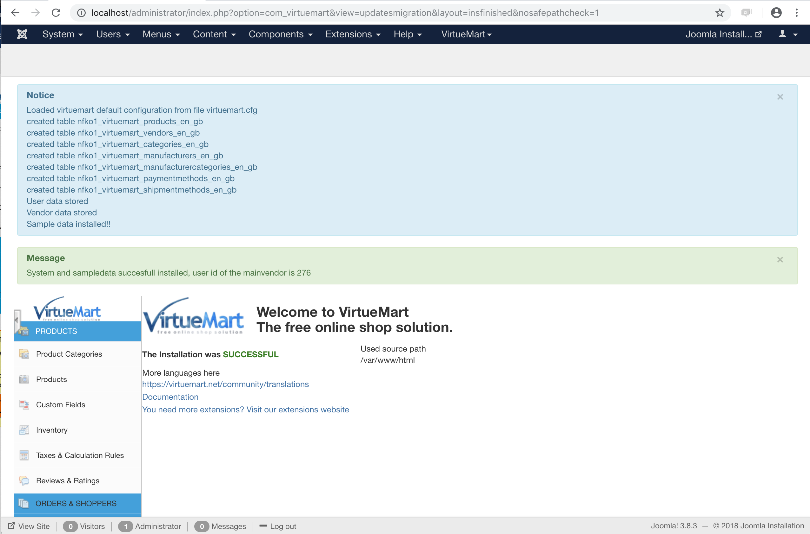

Debes habilitar el registro de usuarios clickeando "Manage" bajo el menú "Users" y una vez que has ingresado presionar el botón [Options].

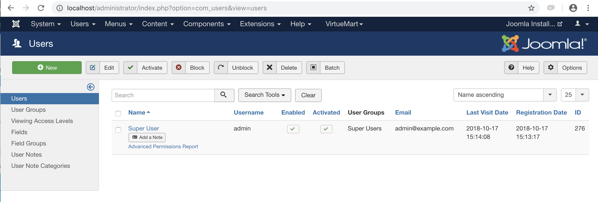

- Allow User registration: **Yes**

Luego presionar el botón [Save] para guardar los cambios.

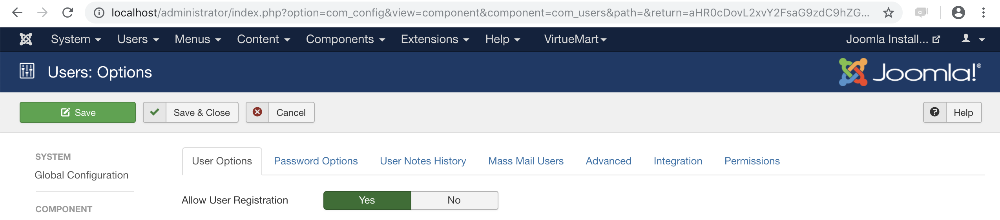

### Configurar moneda Chilena

Ir a (VirtueMart / Shop) y en sección "Currency" elegir "Chilean Peso", luego presionar el botón [Save] para guardar los cambios.

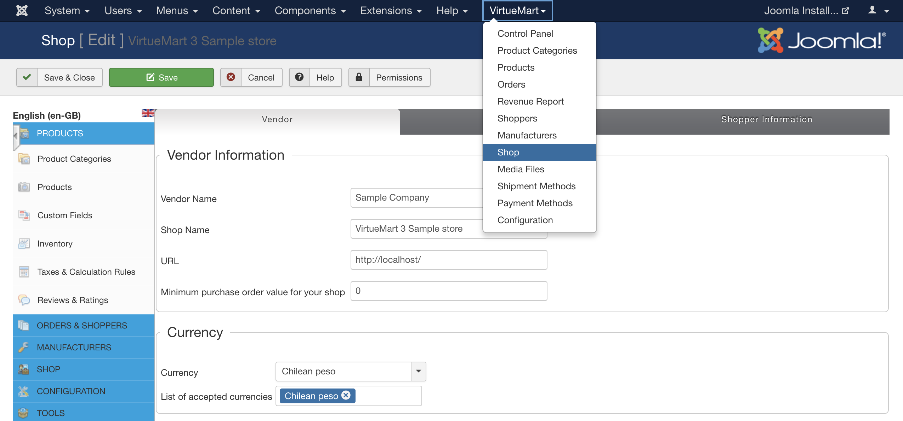

Ir al menu izquierdo (Configuration / Currencies) y seleccionar "Chilean peso"

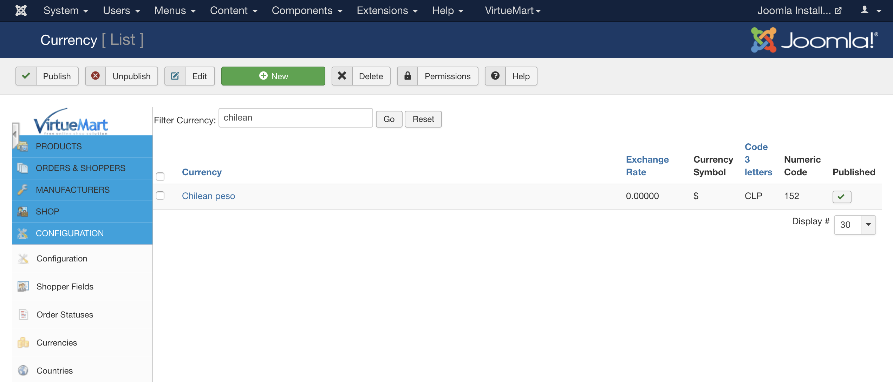

Dejar los valores como se muestran en la siguiente imagen.

- Decimals: 0

Luego presionar el botón [Save] para guardar los cambios.

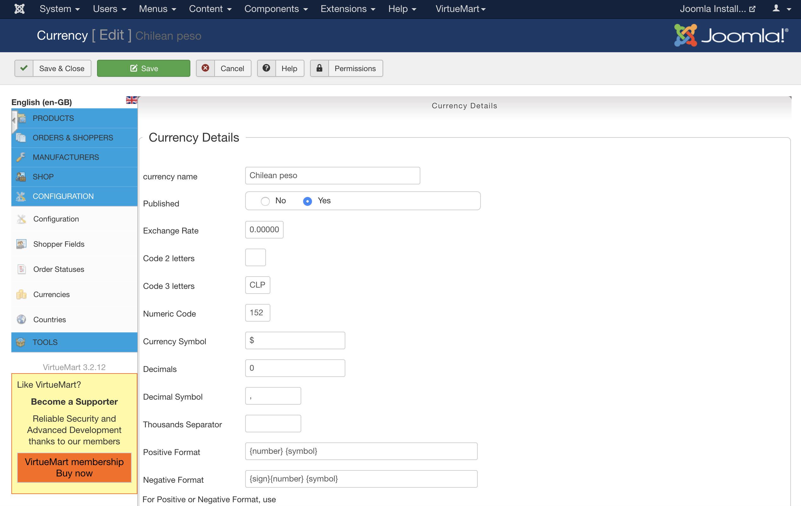

## Extras

### Habilitar y activar usuario registrado para pruebas

Si registras un usuario de prueba para el comercio, luego de registrarlo deberás habilitarlo y activarlo en la sección de usuarios.

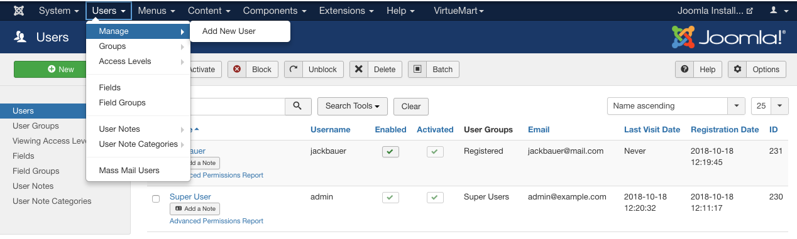

Enabled: Checked  
Activated: Checked

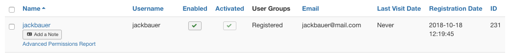

### Configurar error de permisos

Si en algún momento en cualquier pantalla de Joomla aparece el siguiente error, seguir mediante "setup wizard" para corregir.

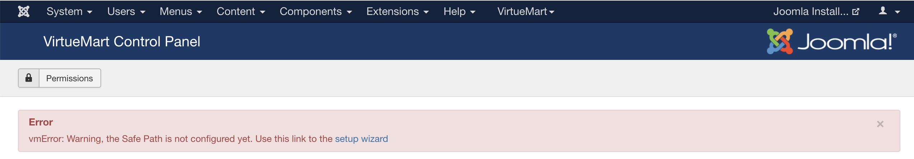

Presionar el botón con el texto "Create and configure safepath using the administrator com_virtuemart folder"

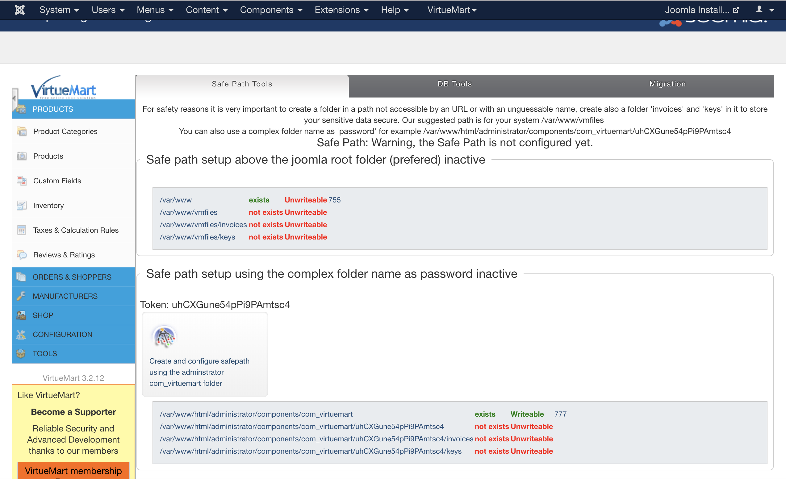

Aceptar el diálogo presionando "Ok"

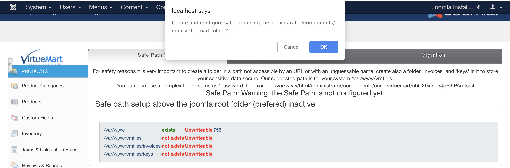

Mostrará que ha sido ejecutado correctamente.

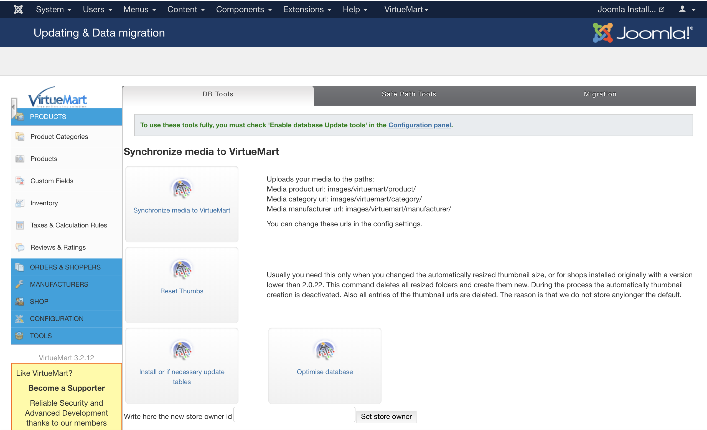

### Archivo de logs del plugin

```
./shell
tail -f /var/www/html/administrator/logs/onepay-log.log.php
```
    
Basado en:

[Imagen docker Virtuemart](https://hub.docker.com/r/opentools/docker-virtuemart/)

[Repository Virtuemart](https://github.com/open-tools/docker-virtuemart)

[Imagen docker mysql](https://hub.docker.com/r/library/mysql/)
