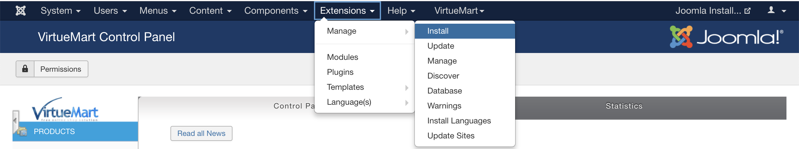
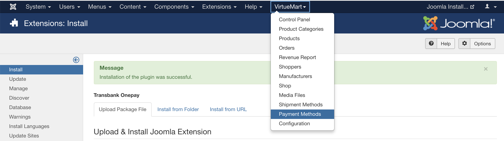
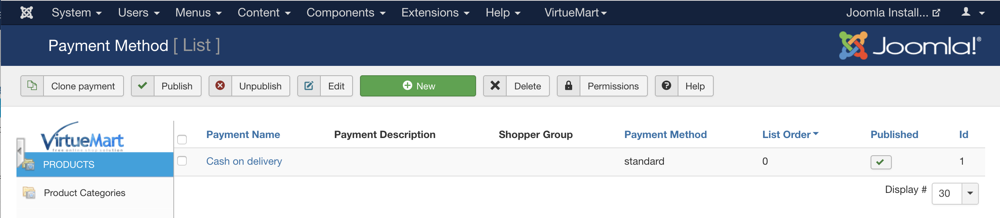

# Manual de instalación para Plugin VirtueMart 3.x

## Descripción

Este plugin oficial ha sido creado para que puedas integrar Onepay fácilmente en tu comercio, basado en VirtueMart 3.x.

## Requisitos

1. Debes tener instalado previamente alguna versión de VirtueMart 3

## Instalación del Plugin

1. Dirígete a [https://github.com/TransbankDevelopers/transbank-plugin-virtuemart-onepay/releases](https://github.com/TransbankDevelopers/transbank-plugin-virtuemart-onepay/releases) y descarga la última versión disponible del plugin.

  Una vez descargado el plugin, ingresa a la página de administración de VirtueMart (usualmente en http://misitio.com/administrator, http://localhost/administrator) y dirígete a Extensions / Installer, indicado a continuación:

  
  
2. Arrastra o selecciona el archivo que descargaste en el paso anterior. Al finalizar aparecerá que fue instalado exitosamente.

  

  

## Configuración

Este plugin posee un sitio de configuración que te permitirá ingresar credenciales que Transbank te otorgará y además podrás generar un documento de diagnóstico en caso que Transbank te lo pida.

Para acceder a la configuración, debes seguir los siguientes pasos:

1. Dirígete a la página de administración de VirtueMart (usualmente en http://misitio.com/administrator, http://localhost/administrator) e ingresa usuario y clave.

2. Dentro del sitio de administración dirígete a (VirtueMart / Payment Methods).

  

3. Debes crear un nuevo medio de pago presionando el botón [New].

  

4. Ingresar los datos para "Transbank Onepay" como se muestra en la siguiente imagen.

    - Payment Name: Transbank Onepay 
    - Sef Alias: transbank_onepay
    - Published: Yes
    - Payment Method: Transbank onepay
    - Currency: Chilean peso

  

5. Presiona el botón [Save] para guardar el nuevo medio de pago. Se informará que ha sido guardado.

  

6. Selecciona la sección "Configuration" para configurar el plugin.
   
  

7. ¡Ya está! Estás en la pantalla de configuración del plugin, debes ingresar la siguiente información:

  * **Endpoint**: Ambiente hacia donde se realiza la transacción. 
  * **APIKey**: Es lo que te identifica como comercio.
  * **Shared Secret**: Llave secreta que te autoriza y valida a hacer transacciones.
  
  Las opciones disponibles para _Endpoint_ son: "Integración" para realizar pruebas y certificar la instalación con Transbank, y "Producción" para hacer transacciones reales una vez que Transbank ha aprobado el comercio. Dependiendo de cual Endpoint se ha seleccionado el plugin usará uno de los dos set de APIKey y Shared Secret según corresponda.

  Además puedes cambiar los valores de los estados pre-establecidos de las ordenes de acuerdo a tu comercio.
  
### Credenciales de Prueba

Para el ambiente de Integración, puedes utilizar las siguientes credenciales para realizar pruebas:

* APIKey: `dKVhq1WGt_XapIYirTXNyUKoWTDFfxaEV63-O5jcsdw`
* Shared Secret: `?XW#WOLG##FBAGEAYSNQ5APD#JF@$AYZ`

1. Guardar los cambios presionando el botón [Save]
   
  

8. Además, puedes generar un documento de diagnóstico en caso que Transbank te lo pida. Para ello, haz click en "Generar PDF de Diagnóstico" y automáticamente se descargará dicho documento.

  

## Prueba de instalación con transacción

En ambiente de integración es posible realizar una prueba de transacción utilizando un emulador de pagos online.

* Ingresa al comercio

  

* Agrega al carro de compras un producto

  

* Selecciona el carro de compras, ingresa los datos que te pida como dirección, método de envío, selecciona método de pago Transbank Onepay, luego presiona el botón [Confirm Purchase]

  

* Una vez presionado el botón para iniciar la compra, se mostrará la ventana de pago Onepay, tal como se ve en la imagen. Toma nota del número que aparece como "Código de compra", ya que lo necesitarás para emular el pago en el siguiente paso (En este ejemplo 8430 - 7696):
  
  
  
* En otra ventana del navegador, ingresa al emulador de pagos desde [https://onepay.ionix.cl/mobile-payment-emulator/](https://onepay.ionix.cl/mobile-payment-emulator/), utiliza test@onepay.cl como correo electrónico, y el código de compra obtenido desde la pantalla anterior. Una vez ingresado los datos solicitados, presiona el botón "Iniciar Pago":

  
  
* Si todo va bien, el emulador mostrará opciones para simular situaciones distintas. Para simular un pago exitoso, presiona el botón `PRE_AUTHORIZED`. En caso de querer simular un pago fallido, presiona le botón `REJECTED`. Simularemos un pago exitóso presionando el botón `PRE_AUTHORIZED`.

  
  
* Vuelve a la ventana del navegador donde se encuentra VirtueMart y podrás comprobar que el pago ha sido exitoso.

 

* Además si accedes al sitio de administración seccion (VirtueMart / Ordes) se podrá ver la orden creada y el detalle de los datos entregados por Onepay.

 

 
